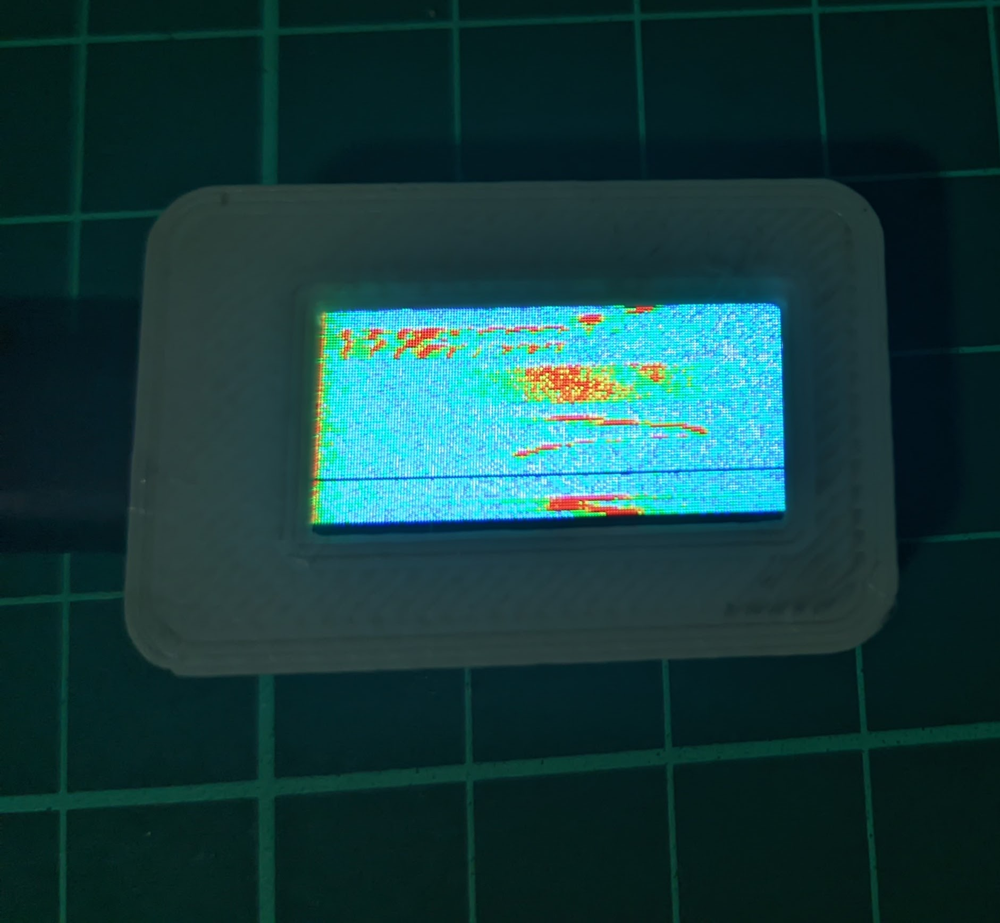

## Requisitos

- Placa con microcontrolador **BL702**.
- Pantalla LCD conectada vía SPI.
- Micrófono conectado a un canal ADC.
- SDK de Bouffalo Lab (BL702).
- Cliente serial USB para debug (opcional).

 <!-- Asegúrate de subir una imagen real del dispositivo funcionando -->

## Compilación

Asegúrese de contar con el SDK y toolchain configurado:

```bash
mkdir build && cd build
cmake ..
make
```

## Uso

1. Flashear el firmware en la placa BL702.
2. Al encender, el sistema inicializa LCD, ADC, DMA y comienza la adquisición.
3. El espectrograma se va dibujando en tiempo real en la pantalla, con barrido vertical.
4. Cada nueva línea del espectrograma sobrescribe a la más antigua en forma circular.

## Visualización

- Cada columna representa una banda de frecuencia.
- Cada fila es una "instantánea" del espectro en el tiempo.
- Colores representan la intensidad (azul = baja, rojo = alta).
- Se usa mapeo RGB565 para visualización en LCD.

## Archivos principales

- `main.c`: lógica principal del sistema, setup de periféricos, procesamiento de FFT y dibujo.
- `draw_spectrogram_row()`: función que dibuja cada fila del espectrograma con scroll circular.
- `map_intensity_to_color()`: transforma magnitudes en colores.

## Consideraciones

- Se recomienda usar señales entre 300 Hz y 4 kHz para mejor visualización.
- La frecuencia de muestreo se ajusta automáticamente vía PLL.
- Puede ser modificado fácilmente para guardar datos, enviar por BLE o UART.

## Licencia

Proyecto educativo y experimental distribuido bajo licencia Apache 2.0.

---

Desarrollado para plataformas BL702 con enfoque en procesamiento digital de señales en tiempo real.
    # Este archivo
```
